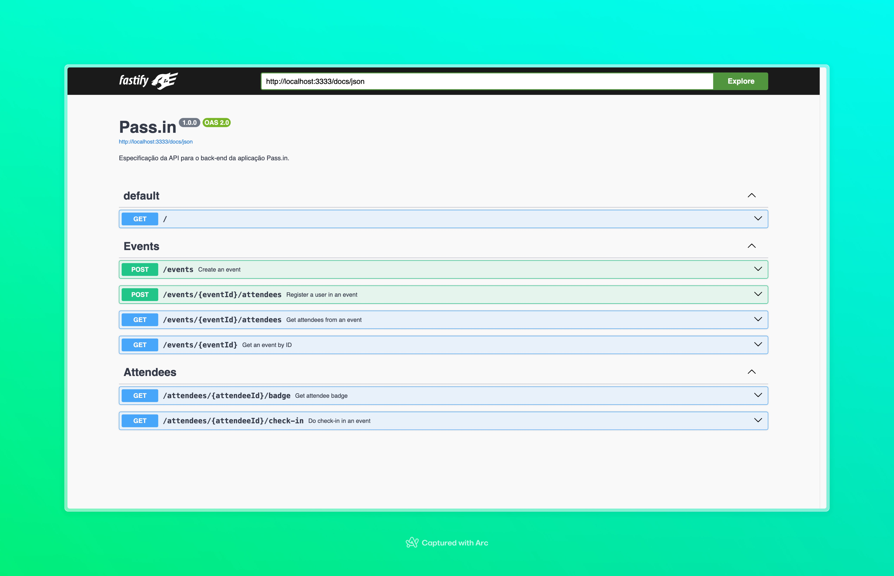
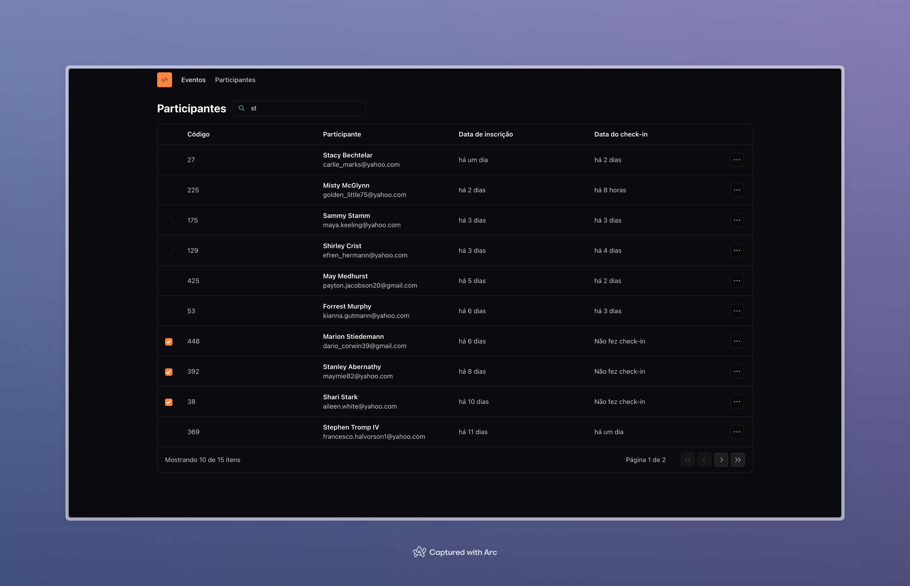
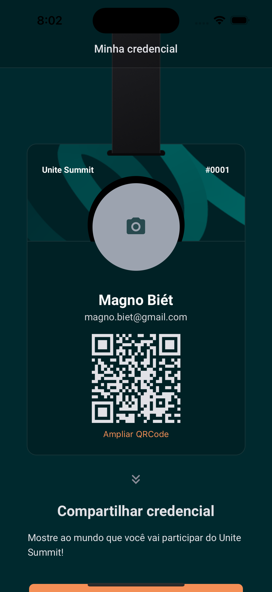

# Pass.in

> O pass.in é uma aplicação de **gestão de participantes em eventos presenciais**.

Project desenvolvido durante o evento NLW Unite (Trilha Node.js, React e React Native) da Rocketseat.

## API (Node.js / Fastify)



```bash
cd api/
npm i
npm run dev
```

## Web (React / Vite)



```bash
cd web/
npm i
npm run dev
```

## App (React Native / Expo)

| Android | iOS |
| - | - |
|  |  |

```bash
cd app/
npm i
npm start
```
